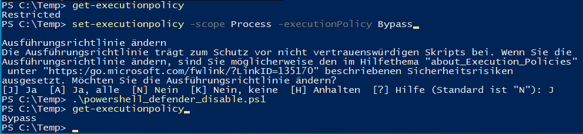

# Cyber Lab – 81a5terfr34k

Willkommen im persönlichen Cybersecurity-Labor von 81a5terfr34k.  
Hier dokumentiere ich meine Projekte, Skripte, Exploits und Analysen.

## Über mich

Ich bin angehender Cybersecurity-Spezialist mit einem Hintergrund in Anwendungsentwicklung und Systemadministration.  
Ich lerne praxisorientiert, analysiere reale Angriffsmethoden und entwickle automatisierte Szenarien, um daraus Verteidigungsstrategien abzuleiten.  
Meine Lab-Umgebung spiegelt mein persönliches Ziel wieder: Remote im Bereich IT-Security tätig zu werden – fokussiert, lernbereit und mit klarem Antrieb.

## Warum dieses Lab?

- Um reale Angriffs- und Verteidigungsszenarien technisch und methodisch zu verstehen
- Um Tools wie PowerShell, Metasploit, BloodHound und eigene Skripte gezielt einzusetzen
- Um Schwachstellen in Windows-Netzwerken (z. B. WSD, SMB, AD) aufzudecken und abzusichern
- Um meine Fortschritte öffentlich zu dokumentieren und meine Fähigkeiten sichtbar zu machen

## Technisches Profil

### Betriebssysteme & Plattformen
- Windows 10/11 (inkl. Hyper-V-Labore)
- Kali Linux / Ubuntu

### Tools & Frameworks
- Metasploit, BloodHound, Nmap, Mimikatz
- PowerShell, GitHub, Event Viewer
- Defender / Exploit Guard

### Schwerpunkte
- Netzwerkangriffe (SMB, WSD, LLMNR)
- Active Directory Enumeration & Angriffe
- Automatisierte Payload-Ausführung über INF, PS, SMB

## Ziel

Praxisorientiertes Lernen, Nachweis meiner Fähigkeiten und Grundlage für Bewerbungen.

## Screenshots

### PowerShell: Defender-Skript Test

⚠️ Hinweis: Der Defender-Dienst `WinDefend` ist ab Windows 10/11 ein „Protected Process“.  
Selbst mit Adminrechten und deaktiviertem Tamper Protection lässt sich dieser nicht stoppen.  
Das demonstriert die Wirksamkeit von Microsofts Schutzmechanismen gegen Bypassing.
