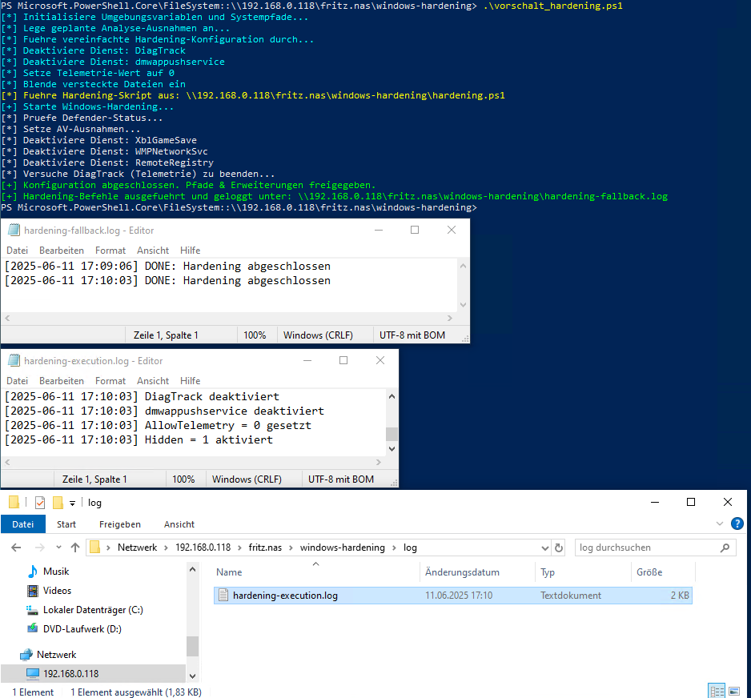

# Windows Hardening Toolkit

Dieses Modul ist Teil des Repositories [`cyber-lab-81a5terfr34k`](https://github.com/Blasterfreak-lab/cyber-lab-81a5terfr34k) und dient der automatisierten Härtung von Windows-Systemen.

---

## 🛡️ Zielsetzung

Das Skript `hardening.ps1` führt sicherheitsrelevante Änderungen durch, um ein Windows-Betriebssystem besser gegen typische Angriffsvektoren zu schützen.

**Typische Einsatzszenarien:**
- Pentesting-Umgebungen (zum Aufbau sicherer Testsysteme)
- IT-Support/Administration
- Sicherheitsschulungen und IT-Simulationen

---

## ⚙️ Funktionen des Skripts

| Abschnitt        | Beschreibung                                                                 |
|------------------|------------------------------------------------------------------------------|
| Defender-Status  | Ruft aktuelle Einstellungen des Microsoft Defenders ab und loggt sie         |
| AV-Ausnahmen     | Fügt eine .exe-Datei sowie Erweiterung und Prozess als Ausnahme hinzu        |
| Dienste          | Deaktiviert unnötige oder gefährliche Windows-Dienste                        |
| Telemetrie       | Schaltet den Dienst `DiagTrack` (Nutzertracking) vollständig ab              |
| Logging          | Erstellt eine Datei `hardening-log.txt` mit allen Maßnahmen                  |

---

### Vorschalt-Hardening

- Führt vorbereitende Sicherheitseinstellungen durch
- Initialisiert Variablen und legt geplante AV-Ausnahmen fest
- Führt `hardening.ps1` aus, wenn vorhanden
- Erstellt automatisch Logdateien im Verzeichnis `log\`



---

## 📦 Dateiübersicht

```bash
/windows-hardening/
├── hardening.ps1        # PowerShell-Hardening-Skript
├── README.md            # Diese Dokumentation
└── screenshots/         # Eigene Beweise (Screenshots, optional)


